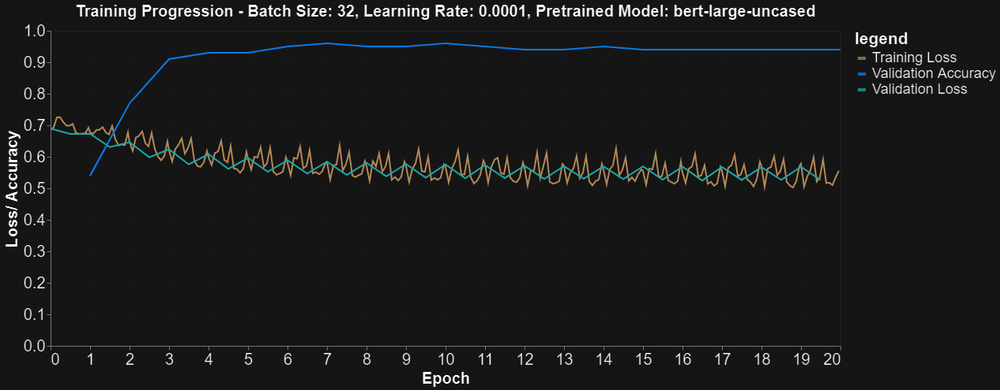

# gammaBERT: Sentiment Analysis Chatbot with BERT

[](https://colab.research.google.com/github/amos-johnson/NLP-BERT/blob/main/notebooks/gammaBERT.ipynb)

Transfer learninging was used on a pre-trained BERT model to classify the sentiment of short product reviews, then built **gammaBot**, a small voice chatbot. gammaBot reads out a fun fact, classifies how you feel about it and responds to match.

**94% test accuracy** on held-out Amazon reviews (96% best validation accuracy).



## Approach

- **Data.** We used the Amazon subset of the [UCI Sentiment Labelled Sentences](https://archive.ics.uci.edu/dataset/331/sentiment+labelled+sentences) dataset: 1,000 one-sentence reviews labelled positive or negative, split 80/10/10 into train, validation and test.
- **Preprocessing.** Sentences are tokenized with the `bert-large-uncased` WordPiece tokenizer, then truncated or padded to 32 tokens with attention masks.
- **Model (`BertClassifier`).**
  - A pre-trained **BERT-large** encoder (24 layers, ~340M parameters) is used as a frozen feature extractor.
  - The `[CLS]` token's final hidden state goes to a small classification head: Linear(1024→500) → Dropout(0.5) → Linear(500→1) → sigmoid.
- **Training.**
  - Loss: binary cross-entropy.
  - Optimizer: Adam (lr 1e-4) with a `ReduceLROnPlateau` scheduler.
  - Batch size 32, 20 epochs, early stopping and checkpointing.
  - Trained on a Google Colab GPU.
- **Baseline comparison.** We also benchmarked Hugging Face's ready-made `BertForSequenceClassification` and `AlbertForSequenceClassification` (ALBERT-xxlarge-v2).
- **Chatbot.** gammaBot picks a prompt, takes your typed reaction, classifies it with the trained model and replies. It speaks through Google Text-to-Speech (`gTTS`).

## Results

| Metric | Value |
|---|---|
| Test accuracy | **94%** |
| Best validation accuracy | 96% |
| Training time | ~4 min (20 epochs, Tesla K80) |

Because BERT's weights stay frozen, the classification head alone reaches 94% after only a few epochs. The limitations and ideas for improvement are in the presentation:
- The model only knows two classes (positive and negative).
- It struggles with one-word reviews and sarcasm.
- The validation and test sets are small (100 sentences each).

## Repository structure

```
├── notebooks/gammaBERT.ipynb              # data prep, model, training, testing, chatbot demo
├── reports/gammaBERT_presentation.pptx    # final presentation (includes energy-cost analysis of BERT)
└── images/                                # figures used in this README
```

## Running it

The notebook is designed for **Google Colab with a GPU runtime**. Click the badge above, then choose *Runtime → Change runtime type → GPU*. The first cell installs its dependencies and downloads the dataset.

To run it locally instead, use `pip install -r requirements.txt`.

## Team

Louise Zalamans · Alexander Mennborg · Amos Johnson · Anton Sundström · Axel Björklund

## Tools

Python · PyTorch · Hugging Face Transformers · BERT / ALBERT · scikit-learn · pandas · Altair · gTTS · Google Colab
